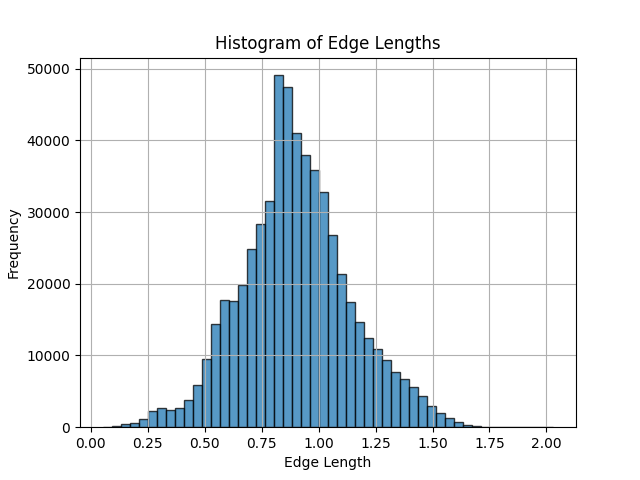
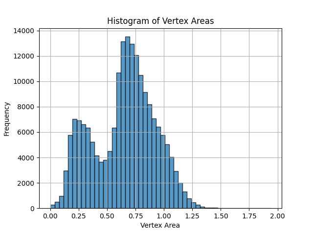

# Brain Mesh Analysis Report

## 1. Data Reading and Processing

The provided "Cort_lobe_poly.vtk" file contains a half-brain mesh structure. The data format is as follows:

- Lines 6 to 191729: x, y, z coordinates of vertices (one vertex per line).
- Lines 191731 to 574971: Triangle definitions. Each line contains four numbers:
    - The first number is always '3', indicating a triangle.
    - The following three numbers are the indices of the vertices forming the triangle.

The `BrainMesh` class (defined in `brain_mesh.h` and `brain_mesh.hxx`) was implemented to read and process this data. The `readData()` function reads the vertex coordinates and triangle definitions from the VTK file and stores them in appropriate data structures.

## 2. Total Surface Area Calculation

The total surface area of the brain mesh was calculated by summing the areas of all triangles. The `getTotalArea()` function in the `BrainMesh` class performs this calculation. The area was computed in both single (`float`) and double (`double`) precision.

**Results:**

- Total brain area (double precision): [Insert your double precision result here]
- Total brain area (single precision): [Insert your single precision result here]

The areas were printed with 14 decimal places using `std::setprecision(14)` with `std::cout`.

## 3. Vertex Areas

The `computeVertexAreas()` function was implemented to calculate the total area of the triangles surrounding each vertex. The results were saved in a file named "vertex_areas.txt", where each line contains the area corresponding to a vertex, sorted by increasing vertex number.

## 4. Histograms

Two histograms were generated using [mention the tool used, e.g., matplotlib]:

### i. Edge Length Histogram

This histogram shows the distribution of edge lengths in the brain mesh.

- **Mean edge length:** [Insert calculated mean edge length]
- **Standard deviation:** [Insert calculated standard deviation]

 

### ii. Vertex Area Histogram

This histogram displays the distribution of vertex areas calculated in the previous step.

## 5. Makefile

A functional Makefile was created to compile and link the code. It includes the following rules:

- **all:** Compiles the code and generates the executable "brain_mesh.exe".
- **clean:** Removes the executable and object files.

## 6. Testing Strategy

To ensure the code's correctness, the following testing strategies were employed:

- **Unit Testing:**  A test case using a simple tetrahedron (defined in "test_file.vtk") was created in `main.cpp`. The `getTotalArea()`, `getEdgeLengths()`, and `getTriangleAreas()` functions were tested by comparing the calculated values with the known, analytically derived values for the tetrahedron. Assertions (`assert()`) were used to verify these comparisons.
- **Area Conservation:** The sum of vertex areas was compared with the total surface area to check for conservation of area.
- **Reasonable Value Checks:** The mean and standard deviation of edge lengths and triangle areas were checked to ensure they fall within reasonable ranges.

The test results were printed to the console, indicating whether the assertions passed or failed.

## 7. Class Structure

The code follows a good object-oriented structure with a clear separation of class declaration (`brain_mesh.h`) and implementation (`brain_mesh.hxx`).

## 8. Template Implementation

The `BrainMesh` class uses templates to allow calculations in both single (`float`) and double (`double`) precision. The integer type can be either `int` or `long`.

## 9. Copy Constructor and Assignment Operator

**(If you implemented these, describe them here. Otherwise, mention that they were not required for this assignment.)**

## 10. Code Documentation

The code is documented with comments explaining the purpose of each function and any complex logic.

## 11. Challenges and Learnings

[Describe any challenges you encountered during the assignment and what you learned from them.]

This report summarizes the analysis of the brain mesh data. The code successfully calculates the total surface area, vertex areas, and generates informative histograms to understand the mesh properties.
