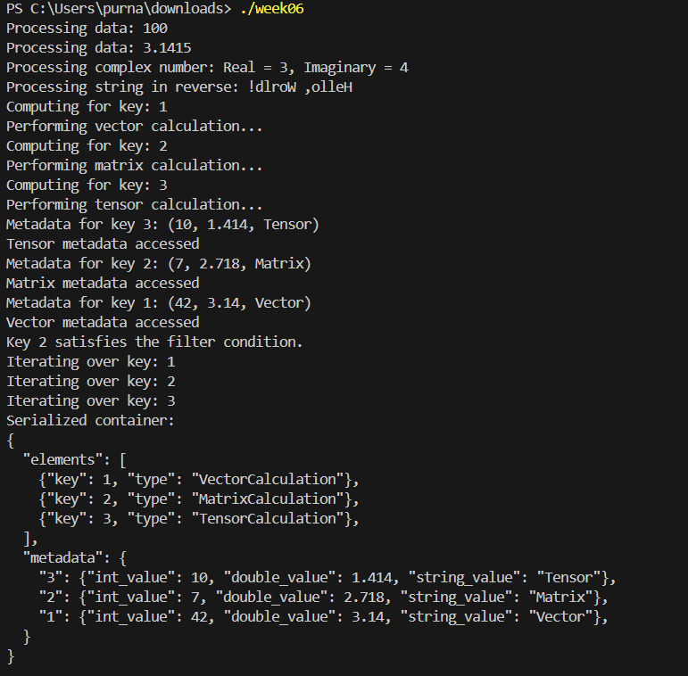

<h1>ScientificContainer Class Documentation</h1>

<h2>Features</h2>
<ul>
    <li><strong>Template Support</strong>: The class supports various arithmetic types and scientific objects, making it versatile for different applications.</li>
    <li><strong>Memory Management</strong>: Utilizes smart pointers (e.g., <code>std::shared_ptr</code>) for automatic memory management, helping to avoid memory leaks.</li>
    <li><strong>Static Assertions</strong>: Employs <code>static_assert</code> to ensure type safety at compile time, preventing misuse of the container with unsupported types.</li>
    <li><strong>Exception Handling</strong>: Implements robust exception handling, providing basic exception safety guarantees for data manipulation functions.</li>
    <li><strong>Metadata Management</strong>: Allows users to associate descriptive metadata with elements, enhancing the usability of the container in scientific applications.</li>
</ul>

<h2>Class Overview</h2>

<h3><code>ScientificContainer&lt;T&gt;</code></h3>

The main class that encapsulates functionality for storing and managing scientific data of type <code>T</code>.

<h3>Member Functions</h3>
<ul>
    <li><code>add_element(const T& element)</code>: Adds an element to the container.
        <ul>
            <li><strong>Exceptions</strong>: Throws a <code>DuplicateElementException</code> if the element already exists in the container.</li>
        </ul>
    </li>
    <li><code>add_metadata(const std::string& key, const std::string& value)</code>: Associates metadata with an element identified by the provided <code>key</code>.
        <ul>
            <li><strong>Exceptions</strong>: Throws an exception if the key already has associated metadata.</li>
        </ul>
    </li>
    <li><code>compute_all()</code>: Computes results for all scientific objects in the container.
        <ul>
            <li><strong>Behavior</strong>: Logs errors if any computation fails but continues processing the remaining elements, ensuring that the container remains operational even if some calculations encounter issues.</li>
        </ul>
    </li>
</ul>

<h2>Usage</h2>

<h3>1. Include the Necessary Headers</h3>

To utilize the <code>ScientificContainer</code>, include its header file in your project:

<pre><code>#include "ScientificContainer.h"</code></pre>

<h3>2. Create an Instance of <code>ScientificContainer</code></h3>

You can create an instance of <code>ScientificContainer</code> by specifying the desired data type. For example, to create a container for double values:

<pre><code>ScientificContainer&lt;double&gt; container;</code></pre>

<h3>3. Add Elements and Metadata</h3>

To add elements and their associated metadata, use the provided member functions:

<pre><code>container.add_element(3.14);
container.add_metadata("pi", "Mathematical constant");</code></pre>

<h3>4. Perform Computations</h3>

Once you have added your elements and metadata, you can perform computations on the data:

<pre><code>container.compute_all();</code></pre>

<h2>Example</h2>

Here’s a simple example demonstrating how to use the <code>ScientificContainer</code>:

<pre><code>#include "ScientificContainer.h"

int main() {
    ScientificContainer&lt;double&gt; container;
    
    // Adding elements
    container.add_element(3.14);
    container.add_element(2.71);
    
    // Adding metadata
    container.add_metadata("pi", "Mathematical constant");
    
    // Performing computations
    container.compute_all();
    
    return 0;
}</code></pre>

<h2>Exception Handling</h2>

The container functions throw exceptions to handle errors effectively. When using the container, it is recommended to wrap calls in try-catch blocks to manage exceptions gracefully. Here’s an example:

<pre><code>try {
    container.add_element(3.14);
} catch (const DuplicateElementException& e) {
    std::cerr << "Error: " << e.what() << std::endl;
}</code></pre>

<h2>Building the Project</h2>

To compile the project, you can use a C++ compiler like <code>g++</code>. Run the following command in your terminal:

<pre><code>g++ -o week06 week06.cpp</code></pre>

<h2>Output</h2>

Here are some example outputs generated by the <code>ScientificContainer</code>:

</body>
</html>
